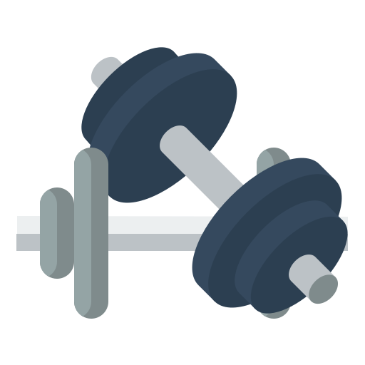

<!-- PROJECT -->
 

  

  <h1 align="center">RepIt</h1>

  <h3 align="center">A MERN stack fitness logger to help you track workouts and build consistency.
     
     
    <a href="https://repitapp.vercel.app/">https://repitapp.vercel.app/</a>
  </h3>

<!-- ABOUT THE PROJECT -->
## About The Project

  

- The motivation behind this app: I found fitness tracking apps are often locked behind paywalls. I wanted a simple, free, and customizable solution where users can log workouts and monitor progress over time.
- RepIt provides an easy way to keep track of workouts and progress. Users can record exercises, sets, reps, and notes.

## Built With

* 
* 
* 
* 
* 
* 
* 
* 
* 

<!-- ROADMAP -->
## Roadmap

- [x] User authentication (signup/login)  
- [x] Create workout logging page  
- [x] Dashboard for viewing workouts  
- [x] Delete logged workouts
- [ ] Edit logged workouts
- [ ] Add graphs to track progress over time  
- [ ] Calendar view of workouts  
- [ ] Add reminders/notifications  
- [ ] Dark mode toggle  
- [ ] Social/sharing features for accountability  

(<a href="#readme-top">back to top</a>)

